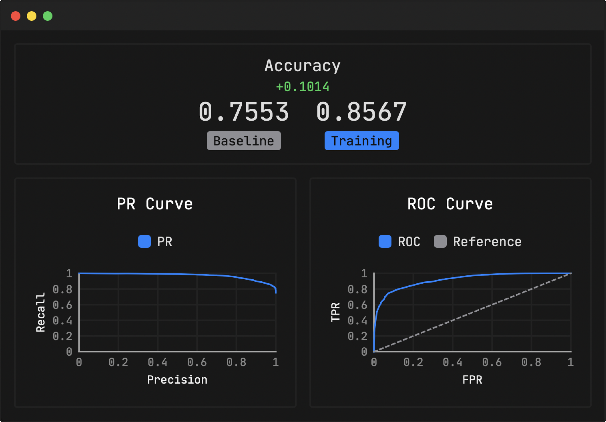
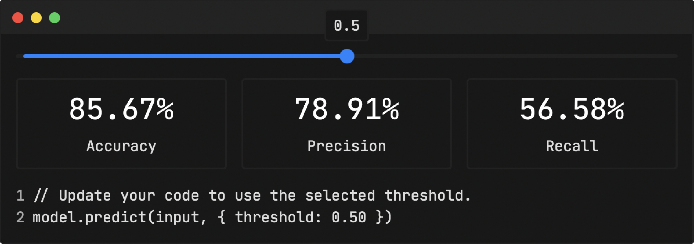
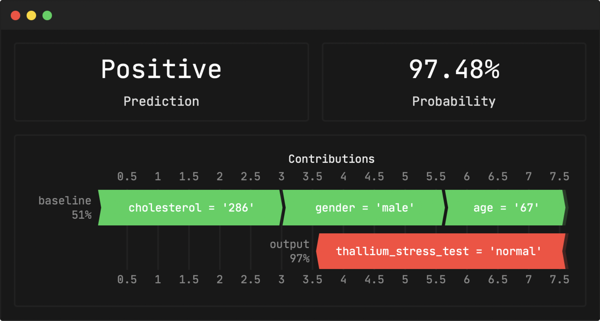
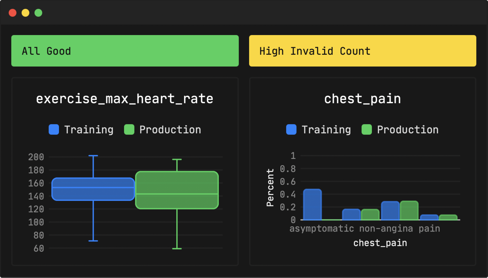
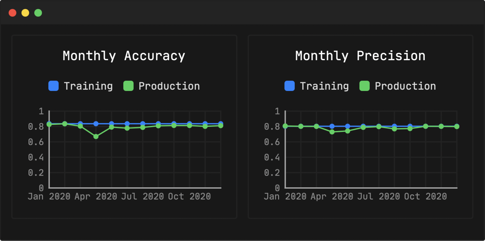

<p align="center">
	
</p>

# Tangram

Tangram is an all-in-one automated machine learning framework.

- Run `tangram train` to train a model from a CSV file on the command line.
- Make predictions with libraries for [Elixir](https://hex.pm/packages/tangram), [Go](https://pkg.go.dev/github.com/tangramxyz/tangram-go), [JavaScript](https://www.npmjs.com/package/@tangramxyz/tangram), [Python](https://pypi.org/project/tangram), [Ruby](https://rubygems.org/gems/tangram), and [Rust](lib.rs/tangram).
- Run `tangram app` to learn more about your models and monitor them in production.

### Install

[Install the `tangram` CLI](https://www.tangram.xyz/docs/install)

### Train

Train a machine learning model by running `tangram train` with the path to a CSV file and the name of the column you want to predict.

```
$ tangram train --file heart_disease.csv --target diagnosis --output heart_disease.tangram
✅ Loading data.
✅ Computing features.
🚂 Training model 1 of 8.
[==========================================>                         ]
```

The CLI automatically transforms your data into features, trains a number of models to predict the target column, and writes the best model to a `.tangram` file. If you want more control, you can provide a config file.

### Predict

Make predictions with libraries for [Elixir](https://hex.pm/packages/tangram), [Go](https://pkg.go.dev/github.com/tangramxyz/tangram-go), [JavaScript](https://www.npmjs.com/package/@tangramxyz/tangram), [Python](https://pypi.org/project/tangram), [Ruby](https://rubygems.org/gems/tangram), and [Rust](https://lib.rs/tangram).

```javascript
let tangram = require("@tangramxyz/tangram")

let model = new tangram.Model("./heart_disease.tangram")

let input = {
	age: 63,
	gender: "male",
	// ...
}

let output = model.predict(input)
console.log(output)
```

```javascript
{ className: 'Negative', probability: 0.9381780624389648 }
```

### Inspect

Run `tangram app`, open your browser to http://localhost:8080, and upload the model you trained.

- View stats and metrics.
- Tune your model to get the best performance.
- Make example predictions and get detailed explanations.





### Monitor

Once your model is deployed, make sure that it performs as well in production as it did in training. Opt in to logging by calling `logPrediction`.

```javascript
// Log the prediction.
model.logPrediction({
	identifier: "6c955d4f-be61-4ca7-bba9-8fe32d03f801",
	input,
	options,
	output,
})
```

Later on, if you find out the true value for a prediction, call `logTrueValue`.

```javascript
// Later on, if we get an official diagnosis for the patient, log the true value.
model.logTrueValue({
	identifier: "6c955d4f-be61-4ca7-bba9-8fe32d03f801",
	trueValue: "Positive",
})
```

Now you can:

- Look up any prediction by its identifier and get a detailed explanation.
- Get alerts if your data drifts or metrics dip.
- Track production accuracy, precision, recall, etc.







## Contributing

This repository is a Cargo workspace, and does not require anything other than the latest stable Rust toolchain to get started with.

1. Install [Rust](rust-lang.org) on Linux, macOS, or Windows.
2. Clone this repo and `cd` into it.
3. Run `cargo run` to run a debug build of the CLI.

If you are working on the app, run `scripts/app/dev`. This rebuilds and reruns the CLI with the `app` subcommand as you make changes.

Before submitting a pull request, please run `scripts/fmt` and `scripts/check` at the root of the repository to confirm that your changes are formatted correctly and do not have any errors.

To install all dependencies necessary to work on the language libraries, install [Nix](https://nixos.org) with [flake support](https://nixos.wiki/wiki/Flakes), then run `nix develop` or set up [direnv](https://github.com/direnv/direnv).

## License

All of this repository is MIT licensed, except for the `crates/app` directory, which is source available and free to use for testing, but requires a paid license to use in production. Send us an email at hello@tangram.xyz if you are interested in a license.
