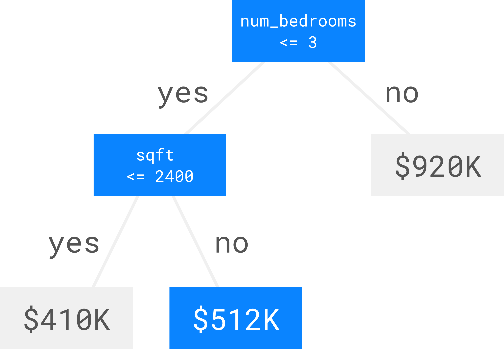
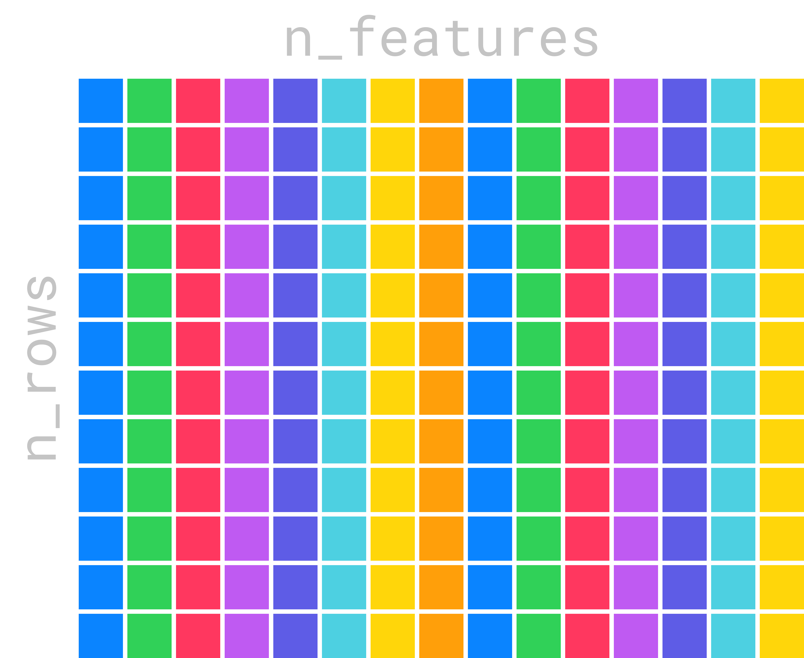
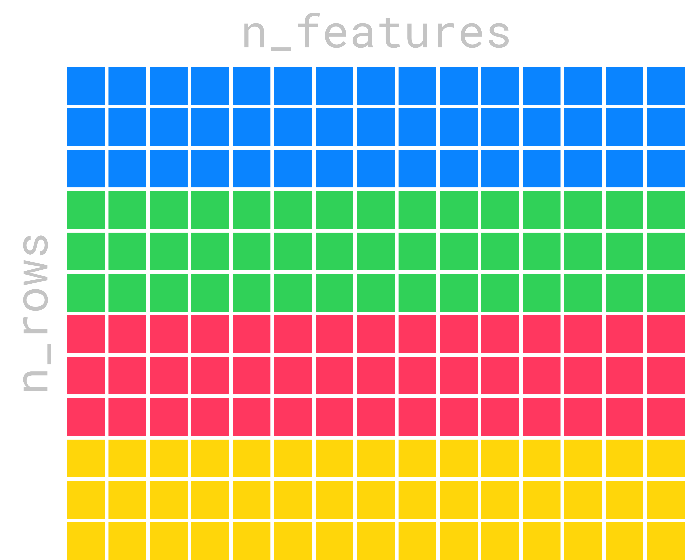

{
"title": "Writing the fastest GBDT library in Rust",
"date": "December 14, 2021",
"author": {
"name": "Isabella Tromba",
"gravatar": "https://gravatar.com/avatar/b5c16153bae7a6fa6663d7f555906dd0?s=100"
}
}

In this post, we will go over how we optimized our Gradient Boosted Decision Tree library. This is based on a talk that we gave at RustConf 2021: [Writing the Fastest Gradient Boosted Decision Tree Library in Rust](https://www.youtube.com/watch?v=D1NAREuicNs). The code is available on [GitHub](https://github.com/tangramdotdev/tangram/tree/main/crates/tree).

<div style="position: relative; padding-bottom: 56.25%; ">
  <iframe
    style="position:absolute;top:0;left:0;width:100%;height:100%;"
    src="https://www.youtube-nocookie.com/embed/D1NAREuicNs"
    title="YouTube video player"
    frameborder="0"
    allow="accelerometer; autoplay; clipboard-write; encrypted-media; gyroscope; picture-in-picture"
    allowfullscreen>
  </iframe>
</div>

The content of this post is organized into following sections:

1. [What are GBDTs](#what_are_gbdts?).
2. [Use Rayon to Parallelize](#use_rayon_to_parallelize).
3. [Use cargo-flamegraph to find bottlenecks](#use_cargo_flamegraph_to_find_bottlenecks).
4. [Use cargo-asm to identify suboptimal code generation](#use_cargo_asm_to_identify_suboptimal_code_generation).
5. [Use intrinsics to optimize for specific CPUs](#use_intrinsics_to_optimize_for_specific_cpus).
6. [Use unsafe code to eliminate unnecessary bounds checks](#use_unsafe_code_to_eliminate_unnecessary_bounds_checks).
7. [Use unsafe code to parallelize non-overlapping memory access](#use_unsafe_code_to_parallelize_non_overlapping_memory_access).

## What are GBDTs?

GBDT stands for Gradient Boosted Decision Tree. GBDTs are a type of machine learning model that perform incredibly well on tabular data. Tabular data is data that you would normally find in a spreadsheet or csv.

In order to get a feeling for how GBDT's work, let's go through an example of making a prediction with a single decision tree. Let’s say you want to predict the price of a house based on features like the number of bedrooms, bathrooms, and square footage. Here is a table with 3 features `num_bedrooms`, `num_bathrooms` and `sqft`. The final column called `price` is what we are trying to predict.

| num_bedrooms | num_bathrooms | sqft | price |
| ------------ | ------------- | ---- | ----- |
| 2            | 2             | 1200 | $300k |
| 4            | 3.5           | 2300 | $550k |
| 3            | 3             | 2200 | $450k |
| 8            | 9             | 7000 | $990k |

To make a prediction with a decision tree, you start at the top of the tree, and at each branch you ask how one of the features compares with a threshold. If the value is less than or equal to the threshold, you go to the left child. If the value is greater, you go to the right child. When you reach a leaf, you have the prediction.


Let’s make an example prediction. We have a house with 3 bedrooms, 3 bathrooms, and 2500 square feet. Let’s see what price our decision tree predicts.

| num_bedrooms | num_bathrooms | sqft | price |
| ------------ | ------------- | ---- | ----- |
| 3            | 3             | 2500 | ?     |

Starting at the top, the number of bedrooms is 3 which is less than or equal to 3, so we go left. The square footage is 2500 which is greater than 2400, so we go right, and we arrive at the prediction which is $512K.



A single decision tree isn’t very good at making predictions on its own, so we train a bunch of trees, one at a time, where each tree predicts the error in the sum of the outputs of the trees before it. This is called gradient boosting over decision trees!

Making a prediction with gradient boosted decision trees is easy. We start with a baseline prediction which in the case of regression (predicting a continuous value like the price of a home) is just the average price of houses in our dataset. Then, we run the process we described for getting a prediction out of a single decision tree for each tree and sum up the outputs. In this example, the prediction is $340K.


To learn more about GBDT's check out the [wikipedia article on gradient boosting](https://en.wikipedia.org/wiki/Gradient_boosting).

## Use Rayon to Parallelize

So now that we know a little about GBDT's, let's talk about how we made our code fast. The first thing we did was parallelize our code. [Rayon](https://github.com/rayon-rs/rayon) makes this really easy. Rayon is a data parallelism library for Rust that makes converting sequential operations into parallel ones extremely easy.


The process of training trees takes in a matrix of training data which is n_rows by n_features.



To decide which feature to use at each node, we need to compute a score for each feature. We do this by iterating over each column in the matrix. The following is a sequential iteration over the columns.

```rust
dataset.columns().iter().map(|column| {
  // compute the score of branching on this feature
})
```

We can parallelize this code with Rayon. All we have to do is change the call to `iter` to `par_iter`.

```rust
dataset.columns().par_iter().map(|column| {
  // compute the score of branching on this feature
})
```

Rayon will keep a thread pool around and schedule items from your iterator to be processed in parallel. Parallelizing over the features works well when the number of features is larger than the number of cores on your computer. When the number of features is smaller than the number of logical cores in your computer, parallelizing over the features is not as efficient. This is because some of our cores will be sitting idle so we will not be using all of the compute power available to us. You can see this clearly in the image below. Cores 1 through 4 have work to do because they have features 1 through 4 assigned to them. Cores 5 through 8 though are sitting idle.


In this situation, we can parallelize over chunks of rows instead and make sure we have enough chunks so that each core has some work to do.



Each core now has some rows assigned to it, and no core is sitting idle.


Distributing the work across rows is super easy with Rayon as well. We just use the combinator `par_chunks`!

```rust
dataset.rows().par_chunks(N).map(|chunk| {
  // process the chunk
});
```
These are just a couple of the combinators available in Rayon. There are a lot of other high-level combinators that make it easy to express complex parallel computations. Check out [Rayon](https://github.com/rayon-rs/rayon) on GitHub to learn more.

## Use cargo-flamegraph to find bottlenecks

Next, we used [cargo-flamegraph](https://github.com/flamegraph-rs/flamegraph) to find where most of the time was being spent. `Cargo-flamegraph` makes it easy generate flamegraphs and integrates elegantly with cargo. You can install it with `cargo install`, then run `cargo flamegraph` to run your program and generate a flamegraph.

```
sudo apt install -y linux-perf
cargo install flamegraph
cargo flamegraph
```

Here is a simple example with a program that calls two subroutines, `foo` and `bar`.

```rust
fn main() {
  foo();
  bar();
}
```

When we run `cargo flamegraph` we get an output that looks like this.


It contains a lot of extra functions that you have to sort through, but it boils down to something like this.


The y-axis of the graph is the call stack, and the x axis is duration. The bottom of the graph shows that the entire duration of the program was spent in the main function. Above that, you see that the main function’s time is broken up between calls to `foo` and `bar`, and that about two thirds of the time was spent in `foo` and its subroutines and about one third of the time spent in bar and its subroutines.

In our code for training decision trees, the flamegraph showed one function where the majority of the time was spent. In this function, we maintain an array of the numbers `0` to `n` that we call `indexes`, and at each iteration of training we rearrange it. Then, we access an array of the same length, called `values`, but in the order of the indexes in the `indexes` array.

```rust
let indexes = (0..n).collect();

// rearrange indexes

for index in indexes {
  let mut value = values.get_mut(index);
  // mutate the value
}
```

This results in accessing each item in the `values` array out of order. We will refer back to this function throughout the rest of this post.

## Use cargo-asm to identify suboptimal code generation

From the flamegraph, we knew which function was taking the majority of the time, which we briefly described above. We started by looking at the assembly code it generated to see if there were any opportunities to make it faster. We did this with [cargo-asm](https://github.com/gnzlbg/cargo-asm).

```bash
cargo install cargo-asm
cargo asm --rust path::to::a::function
```

Like `cargo-flamegraph`, `cargo-asm` is really easy to install and integrates nicely with cargo. You can install it with `cargo install`, and run it as a cargo subcommand.

Here is a simple example with a function that adds two numbers and multiplies the result by two.

```rust
pub fn sum_times_two(x: i32, y: i32) -> i32 {
  let sum = x + y;
  let sum_times_two = sum * 2;
  sum_times_two
}
```

When we run `cargo asm`, we get an output that looks like this. It shows the assembly instructions alongside the rust code that generated them.

```rust
// pub fn sum_times_two(x: i32, y: i32) -> i32 {
// let sum = x + y;
add        edi, esi
// let sum_times_two = sum * 2;
lea        eax, [rdi, +, rdi]
//}
ret
//}
```

Note that due to all the optimizations the compiler does, there is often not a perfect correlation from the rust code to the assembly.

```rust
for index in indexes {
  let mut value = values.get_mut(index);
  // mutate the value
}
```

When we looked at the assembly for this loop, we were surprised to find an [`imul`](https://www.felixcloutier.com/x86/imul) instruction, which is an integer multiplication.

```
imul     rax, qword, ptr, [r8, +, 16]
```

What is that doing in our code? We are just indexing into an array of f32’s. f32’s are 4 bytes each, so the compiler should be able to get the address of the ith item by multiplying i \* 4. Multiplying by four is the same as shifting i left by two. Shifting left by two is much faster than integer multiplication.

```rust
for index in indexes {
  let mut value = values.get_mut(index);
  // mutate the value
}
```

Why would the compiler not be able to produce a shift left instruction? Well, the `values` array is a column in a matrix and a matrix can be stored either in row major or column major order. This means that indexing into the column might require multiplying by the number of columns in the matrix, which is unknown at compile time. But since we were storing our matrix in column major order, we could eliminate the multiplication, but we have to convince the compiler of this.

```rust
let values = values.as_slice();
// for index in indexes {
  // let mut value = valuues.get_mut(index);
  // mutate the value
// }
```

We did this by casting the `values` array to a slice. This convinced the compiler that the `values` array was contiguous, so it could access items using the shift left instruction, instead of integer multiplication.

## Use intrinsics to optimize for specific CPUs

Next, we used compiler intrinsics to optimize for specific CPUs. Intrinsics are special functions that hint to the compiler to generate specific assembly code.

```rust
for index in indexes {
  let mut value = values.get_mut(index);
  // mutate the value
 }
```


Remember how we noticed that this code results in accessing the `values` array out of order? This is really bad for cache performance, because CPUs assume you are going to access memory in order. If a value isn’t in cache, the CPU has to wait until it is loaded from main memory, making your program slower.


However, we know which values we are going to be accessing a few iterations of the loop in the future. We know this because the indexes are given by the `indexes` array. So 10 iterations in the future, we will be accessing `values[indexes[current_index + 10]]`. We can hint to x86_64 CPU’s to prefetch those values into cache using the [mm_prefetch](https://doc.rust-lang.org/beta/core/arch/x86_64/fn._mm_prefetch.html) intrinsic. We experimented with different values of the `OFFSET` until we got the best performance. If the `OFFSET` is too small, the CPU will still have to wait for the data, if the `OFFSET` is too large, data that the CPU needs might be evicted and by the time the CPU gets to the iteration that needs the data, it will no longer be there. The best offset will vary depending on your computer's hardware so it can be more of an art than a science.

```rust
for index in indexes {
  mm_prefetch(values.as_ptr().offset(index + OFFSET));
  let value = values[index];
  // do something with value
}
```

If you are interested in cache performance and writing performant code, check out [Mike Acton's talk on Data-Oriented Design](https://www.youtube.com/watch?v=rX0ItVEVjHc) and [Andrew Kelly's recent talk at Handmade Seattle](https://media.handmade-seattle.com/practical-data-oriented-design/).

## Use unsafe code to eliminate unnecessary bounds checks

Next, we used a touch of unsafe to remove some unnecessary bounds checks.

```rust
// for index in indexes {
  let mut value = values.get_mut(index);
  // mutate the value
//}
```

Most of the time, the compiler can eliminate bounds checks when looping over values in an array. However, in this code, it has to check that `index` is within the bounds of the values array.

```rust
// for index in indexes {
  let mut value = values.get_unchecked_mut(index);
  // mutate the value
// }
```

But we said at the beginning that the indexes array is a permutation of the values 0 to n. This means the bounds check is unnecessary. We can fix this by replacing `get_mut` with `get_unchecked_mut`. We have to use unsafe code here, because Rust provides no way to communicate to the compiler that the values in the `indexes` array are always in bounds of the `values` array.

## Use unsafe code to parallelize non-overlapping memory access

Finally, we parallelized the following code:

```rust
for index in indexes {
  let mut value = values.get_mut(index);
  // mutate the value
}
```

But is it even possible to parallelize? At first glance, it seems the answer is no, because we are accessing the `values` array mutably in the body of the loop.

```rust
indexes.par_iter().for_each(|index| {
  let mut value = values.get_mut(index);
})
```

If we try it, the compiler will give us an error indicating overlapping borrows. However, the `indexes` array is a permutation of the values 0 to n, so we know that the access into the `values` array is never overlapping.

We can parallelize our code using unsafe Rust, wrapping a pointer to the values in a struct and unsafely marking it as Send and Sync.

```rust
struct ValuesPtr(*mut [f32]);
unsafe impl Send for ValuesPtr {}
unsafe impl Sync for ValuesPtr {}
let values = ValuesPtr(values);
indexes.par_iter().for_each(|index| unsafe {
  let mut value = values.0.get_unchecked_mut(index);
})
```

So, going back to the code we started out with...

```rust
for index in indexes {
  let mut value = values.get_mut(index);
  // mutate the value
}
```

Finally, when combining the four optimizations together:

1. Making sure that the `values` array is a contiguous slice.
2. Prefetching values so they are in cache.
3. Removing bounds checks because we know the indexes are always in bounds.
4. Parallelizing over the indexes because we know they never overlap.

this is the code we get:

```rust
struct ValuesPtr(*mut [f32]);
unsafe impl Send for ValuesPtr {}
unsafe impl Sync for ValuesPtr {}
let values = ValuesPtr(values.as_slice());
indexes.par_iter().for_each(|index| unsafe {
  mm_prefetch(values.as_ptr().offset(index + OFFSET));
  let mut value = values.0.get_unchecked_mut(index);
  // mutate the value
})
```

Here are our benchmarks on training time comparing Tangram's Gradient Boosted Decision Tree Library to [LightGBM](https://lightgbm.readthedocs.io/en/latest/), [XGBoost](https://xgboost.readthedocs.io/en/latest/), [CatBoost](https://catboost.ai/), and [sklearn](https://scikit-learn.org/stable/modules/generated/sklearn.ensemble.HistGradientBoostingClassifier.html).


To see all the benchmarks, head over to [https://tangram.dev/benchmarks](https://tangram.dev/benchmarks).

If you are interested in reading the code or giving us a star, the project is available on [GitHub](https://github.com/tangramdotdev/tangram).
